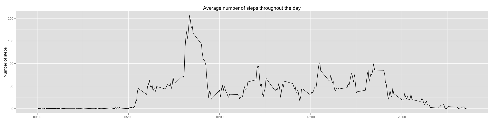
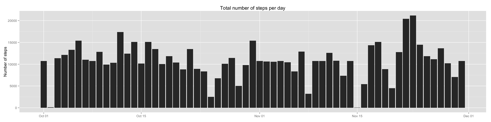
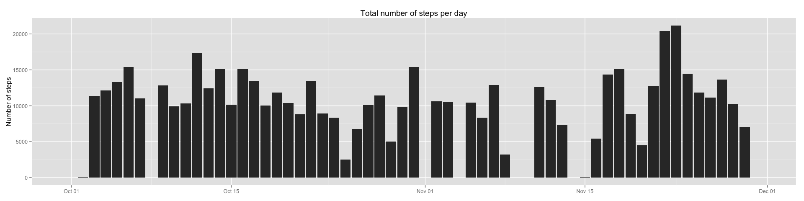
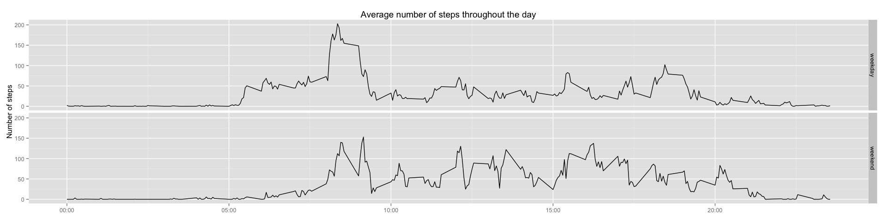

# Reproducible Research: Peer Assessment 1


## Loading and preprocessing the data
First thing, we want to load the data. First obstacle, we have to retrieve it 
from the zip archive.

```r
temp <- tempfile()
temp <- unzip(zipfile = "activity.zip",files = "activity.csv")
data <- read.csv(temp)
head(data)
```

```
##   steps       date interval
## 1    NA 2012-10-01        0
## 2    NA 2012-10-01        5
## 3    NA 2012-10-01       10
## 4    NA 2012-10-01       15
## 5    NA 2012-10-01       20
## 6    NA 2012-10-01       25
```
Now we want to preprocess the data a little bit, for example to get a proper 
date field.

```r
library(lubridate)
data$date <- ymd(data$date)
unlink(temp)
```
## What is mean total number of steps taken per day?
We continue our processing, using library dplyr. We create the object we are interested to print.

```r
library(dplyr)
library(ggplot2)
data_tbl <- tbl_df(data)
data_hist <- group_by(data_tbl, date) %>%
  summarise(sum(steps))
names(data_hist)[2] <- "tot_steps"
```
Now we can print the histogram

```r
ggplot(data_hist, aes(x = date, y = tot_steps)) + geom_bar(stat = "identity") + 
  ggtitle("Total number of steps per day") + 
  theme(axis.title.x = element_blank()) + ylab("Number of steps")
```

 
Now we want to compute the mean and median number of steps per day.

```r
steps_mean <- mean(data_hist$tot_steps, na.rm = TRUE)
steps_median <- median(data_hist$tot_steps, na.rm = TRUE)
print(paste("The average total number of steps per day is:", steps_mean))
```

```
## [1] "The average total number of steps per day is: 10766.1886792453"
```

```r
print(paste("The median total number of steps per day is:", steps_median))
```

```
## [1] "The median total number of steps per day is: 10765"
```

```r
unlink(data_hist)
```
## What is the average daily activity pattern?


```r
data_ts <- group_by(data_tbl, interval) %>%
  summarise(mean(steps, na.rm = TRUE))
names(data_ts)[2] <- "av_steps"
time_format <- function(x){
  h <- floor(trunc(x/100))
  m <- round(100*(x/100-h))
  labl <- sprintf('%02d:%02d',h,m)
}
```


```r
ggplot(data_ts, aes(x = interval, y = av_steps)) + geom_line() + 
  ggtitle("Average number of steps throughout the day") + 
  theme(axis.title.x = element_blank()) + ylab("Number of steps") + 
  scale_x_continuous(label = time_format)
```

 


```r
max_int <- which(data_ts$av_steps == max(data_ts$av_steps))
print(paste("The interval when the maximum number of steps is taken (on average) is:",time_format(data_ts$interval[max_int])))
```

```
## [1] "The interval when the maximum number of steps is taken (on average) is: 08:35"
```
## Imputing missing values
Count the number of NAs

```r
num_nas <- length(data_tbl$steps[is.na(data_tbl$steps)])
print(paste("The number of NAs is:", num_nas))
```

```
## [1] "The number of NAs is: 2304"
```
Now my strategy is to use the rounded mean number of steps for that time interval


```r
data_tbl_2 <- group_by(data_tbl, interval) %>%
  mutate(steps = ifelse(is.na(steps),round(mean(steps,na.rm=TRUE)),steps))
data_hist_2 <- group_by(data_tbl_2, date) %>%
  summarise(sum(steps))
names(data_hist_2)[2] <- "tot_steps"
```


```r
ggplot(data_hist_2, aes(x = date, y = tot_steps)) + geom_bar(stat = "identity") + 
  ggtitle("Total number of steps per day") + 
  theme(axis.title.x = element_blank()) + ylab("Number of steps")
```

 


```r
steps_mean_2 <- mean(data_hist_2$tot_steps, na.rm = TRUE)
steps_median_2 <- median(data_hist_2$tot_steps, na.rm = TRUE)
print(paste("The average total number of steps per day is:", steps_mean_2))
```

```
## [1] "The average total number of steps per day is: 10765.6393442623"
```

```r
print(paste("The median total number of steps per day is:", steps_median_2))
```

```
## [1] "The median total number of steps per day is: 10762"
```

The previous one has the effect of rising the number of steps to some quantity for days when the device has not been worn (here there is no such thing as the right choice, as it might have been forgotten home (so that replacing with the mean in that time interval makes sense), or the wearer might have been home sick (so that a total of 0 is completely reasonable)).
Just to see if things are very different let's take a different strategy: the mean in that day, replacing NaNs with 0 (happens when there are no data for the whole day).


```r
data_tbl_3 <- group_by(data_tbl, date) %>%
  mutate(steps = as.numeric(ifelse(is.na(steps), ifelse(is.nan(round(mean(steps,na.rm=TRUE))),0,round(mean(steps,na.rm=TRUE))),steps)))
data_hist_3 <- group_by(data_tbl_3, date) %>%
  summarise(sum(steps))
names(data_hist_3)[2] <- "tot_steps"
```


```r
ggplot(data_hist_3, aes(x = date, y = tot_steps)) + geom_bar(stat = "identity") + 
  ggtitle("Total number of steps per day") + 
  theme(axis.title.x = element_blank()) + ylab("Number of steps")
```

 


```r
steps_mean_3 <- mean(data_hist_3$tot_steps, na.rm = TRUE)
steps_median_3 <- median(data_hist_3$tot_steps, na.rm = TRUE)
print(paste("The average total number of steps per day is:", steps_mean_3))
```

```
## [1] "The average total number of steps per day is: 9354.22950819672"
```

```r
print(paste("The median total number of steps per day is:", steps_median_3))
```

```
## [1] "The median total number of steps per day is: 10395"
```

```r
unlink(data_hist_3)
```
The average number of steps is way lower in this case, but the median number is not that different. In fact the big difference is that we have days where there are no steps taken that lower a lot the mean, but when steps are taken, they tend to fall around the mean. We will use the second modified dataset.

## Are there differences in activity patterns between weekdays and weekends?


```r
data_ts_n <- mutate(data_tbl_3, we_wd = ifelse(weekdays(date)%in% c("Saturday","Sunday"),"weekend", "weekday" ))
data_ts_n <- group_by(data_ts_n, interval, we_wd) %>%
  summarise(mean(steps, na.rm = TRUE))
head(data_ts_n)
```

```
## Source: local data frame [6 x 3]
## Groups: interval
## 
##   interval   we_wd mean(steps, na.rm = TRUE)
## 1        0 weekday                    2.0222
## 2        0 weekend                    0.0000
## 3        5 weekday                    0.4000
## 4        5 weekend                    0.0000
## 5       10 weekday                    0.1556
## 6       10 weekend                    0.0000
```

```r
names(data_ts_n)[3] <- "av_steps"
```


```r
ggplot(data_ts_n, aes(x = interval, y = av_steps)) + geom_line() + 
  ggtitle("Average number of steps throughout the day") + 
  theme(axis.title.x = element_blank()) + ylab("Number of steps") + 
  scale_x_continuous(label = time_format) + facet_grid(we_wd ~ .)
```

 
