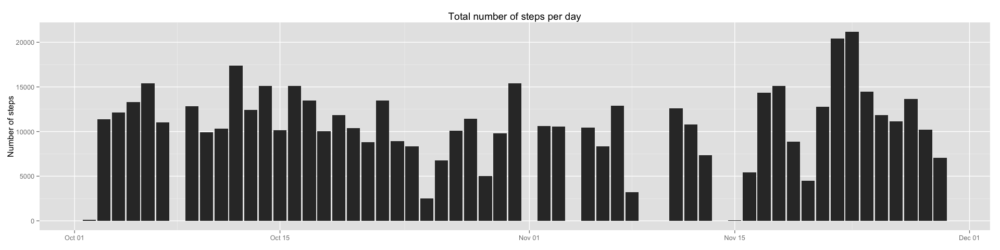

# Reproducible Research: Peer Assessment 1


## Loading and preprocessing the data
First thing, we want to load the data. First obstacle, we have to retrieve it 
from the zip archive.

```r
temp <- tempfile()
temp <- unzip(zipfile = "activity.zip",files = "activity.csv")
data <- read.csv(temp)
head(data)
```

```
##   steps       date interval
## 1    NA 2012-10-01        0
## 2    NA 2012-10-01        5
## 3    NA 2012-10-01       10
## 4    NA 2012-10-01       15
## 5    NA 2012-10-01       20
## 6    NA 2012-10-01       25
```

```r
library(lubridate)
data$date <- ymd(data$date)
head(data)
```

```
##   steps       date interval
## 1    NA 2012-10-01        0
## 2    NA 2012-10-01        5
## 3    NA 2012-10-01       10
## 4    NA 2012-10-01       15
## 5    NA 2012-10-01       20
## 6    NA 2012-10-01       25
```
Now we want to preprocess the data a little bit, for example to get a proper 
date field.

```r
#setClass('myDate')
#setAs("character", "myDate", function(from) as.Date(from, format = "%Y-%m-%d"))
#setClass('myTime')
#setAs("character", "myTime", function(from) format(from, format = "%T"))
#data <- read.csv(temp, colClasses = c("numeric", "myDate", "myTime"))
unlink(temp)
#head(data)
```
## What is mean total number of steps taken per day?

```r
library(dplyr)
```

```
## 
## Attaching package: 'dplyr'
## 
## The following objects are masked from 'package:lubridate':
## 
##     intersect, setdiff, union
## 
## The following objects are masked from 'package:stats':
## 
##     filter, lag
## 
## The following objects are masked from 'package:base':
## 
##     intersect, setdiff, setequal, union
```

```r
library(ggplot2)
data_tbl <- tbl_df(data)
data_hist <- group_by(data_tbl, date) %>%
  summarise(sum(steps))
names(data_hist)[2] <- "tot_steps"
# plot(data_hist, type = "h",
#      main = "Total number of steps per day",
#      xlab = "Date",
#      ylab = "Number of steps")
#head(data_hist)
```

```r
ggplot(data_hist, aes(x = date, y = tot_steps)) + geom_bar(stat = "identity") + 
  ggtitle("Total number of steps per day") + 
  theme(axis.title.x = element_blank()) + ylab("Number of steps")
```

```
## Warning: Removed 8 rows containing missing values (position_stack).
```

 

```r
# data_tbl_alt <- group_by(data_tbl, date)
# ggplot(data_tbl_alt, aes(x = date, y = steps)) + geom_bar(stat = "identity")
```


## What is the average daily activity pattern?


## Imputing missing values


## Are there differences in activity patterns between weekdays and weekends?
